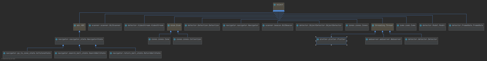
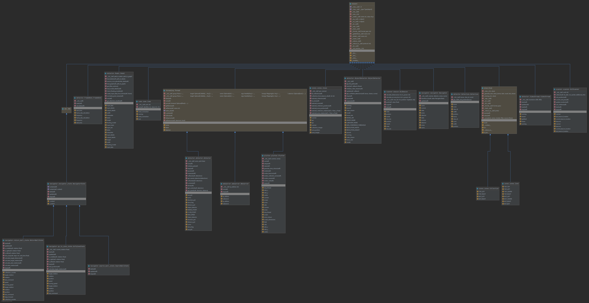

# 🎾🤖 TennisBallBot

## Diagrams

### Domain



### Application




## Installation 

### 🍰 Raspberry pi

* Update the Raspberry pP's code bij executing the following two lines.

```
sudo apt update
sudo apt full-upgrade
```

* Enable the pi cam by running `sudo raspi-config`, and go to the promp in _Interfacing Options > Camera_. And reboot.

* Execute `./raspberry/install_dependencies.sh`.

* Change your work directory to the webapp folder `cd raspberry/webserver/webapp`.

* Create an environment file `cp .env.example .env.local`.

* Fill in the api uri, this should be the IP of the Raspberry: `http://` + IP + `/api/` note the trailing slash.
    * Alternatively you can just do `/api/`.

* Execute `npm install && npm run build`.

### 🍣 Zumo

* Plug the Zumo into the host machine via USB.

* Open the `zumo/build.sh` file and change the port to the port your Zumo uses.

* Make sure that `arduino-cli` and `screen` are installed.

* Flash the software by running the script `./zumo/build.sh`.

### 📡 Beacons

* Plug a beacon into the host machine via USB.

* Open the `beacon/build.sh` file and change the port to the port your beacon uses.

* Make sure that `arduino-cli` and `screen` are installed.

* Flash the software by running the script `./beacon/build.sh`.

* Repeat the last step until all four beacons have beel flashed.

## ⚙📚 Machine learning

To train the Tensorflow Lite model follow the tutorials from EdjeElectronics:

* https://github.com/EdjeElectronics/TensorFlow-Object-Detection-API-Tutorial-Train-Multiple-Objects-Windows-10

* https://github.com/EdjeElectronics/TensorFlow-Lite-Object-Detection-on-Android-and-Raspberry-Pi

After this you should follow some steps to convert the model to a EdgeTPU model (runnable for the Google Coral) 

* Install `edgetpu-compiler`:

```bash
curl https://packages.cloud.google.com/apt/doc/apt-key.gpg | sudo apt-key add -

echo "deb https://packages.cloud.google.com/apt coral-edgetpu-stable main" | sudo tee /etc/apt/sources.list.d/coral-edgetpu.list

sudo apt-get update

sudo apt-get install edgetpu-compiler
``` 

* Run the command `edgetup_compiler [folder of tflite model]`.

* Rename `detect_edgetpu.tflite` to `edgetpu.tflite`

